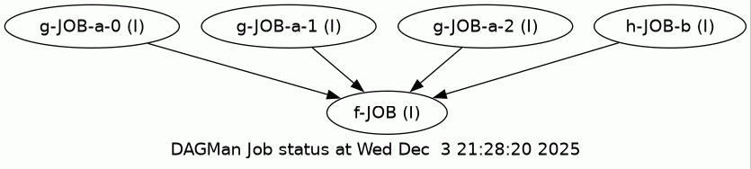

# A simple DAG generator

HTCondor's
[DAGMan](https://htcondor.readthedocs.io/en/latest/automated-workflows/dagman-introduction.html)
is a powerful workflow management system.  Its configuration files are quite
readable, but can be cumbersome to write.  Usually developers will write their
own dag file generator customized to their problem.  This script aims to be a
more general solution for a small, but reasonable, set of problems.  This tool
is not intended as a replacement for
[Snakemake](https://snakemake.readthedocs.io/en/stable/),
[Pegasus](https://pegasus.isi.edu/), or other workflow managers which are far
more sophisticated, but also far more complex and "heavy".


## Design principles and inspiration

The core idea is the observation that programs essentially are functions, they take
input and produce output.  DAGs are therefore a lot like function composition.
These suggest taking a functional approach to rendering DAGs.  Consider the Python
function

```python
f(10, [g(x) for x in range(5)], h(12))
```

There is a clear dependency relationship here, in order to compute `f` it is
first necessary to compute 5 instances of `g` and one of `h`.  The central 
tasks of this tool are therefore

 1. Provide a means to specify a function in terms of an executable and create submit files
 2. Provide a means to specify an expression in these functions
 3. Determine the dependencies and render the DAG

From the core idea other inspiration came from these notes on [parallelizing for HTCondor ](https://github.com/SyracuseUniversity/OrangeGridExamples/tree/main/Parallelism).
In particular, the inclusion of the `map` operator came from this document, and `reduce` is planned.

Finally, the visualization of DAGs is strongly reminiscent of [string
diagrams](https://arxiv.org/abs/2305.08768) (there is a beautiful and gentle
[introduction](https://graphicallinearalgebra.net/) to this topic in the
context of linear algebra), which is not surprising once the functional
perspective on DAGs is adopted.  This suggests that the formalism that has been
developed around string diagrams might (or might not!) be fruitfully applied to
this problem.


## Complications

Unlike pure functions, programs can accept more than one input and these may come from several places

  * Standard input
  * Values provided on the command line
  * Files named on the command line
  * Files named implicitly in the program
  * Files named in other files!  (I believe either Gromacs or LAMMPS does this)
  * Environment variables

Likewise there may be several outputs:

  * Standard output
  * Files named on the command line
  * Files named implicitly in the program
  * Files named in other files

This complicates the question of how to connect two programs (or, in
diagrammatic terms, what the diagrams must look like and how to glue them
together).  In the Unix world standard output can be wired to standard input
with the pipe (`|`) operator, and standard output can be wired to command line
arguments with the `xargs` command, or shell expansion

```bash
some_command arg1 arg2 $(some_other_command arg3) arg4 ...
```

For the moment this makes a very restrictive assumption, all programs write to
standard out, and all input is provided by naming files to read on the command
line.  One eventual goal is to include other options.


## Building up the language specification, and current status

Here's an example of a simple program:

```
def f(a,b) = "f.sh -a $a $b"
def g(a,b) = "g.sh --a $a --b $b"
def h(a)   = "h.sh $a"

f(g(2,3),h(4))
```

This defines three functions.  The last line defines the workflow:

  * Run `h(4)`, producing standard out (written to a file whose name is programmatically generated)
  * In parallel run `g(2,3)` producing standard out (written to a file whose name is programmatically generated)
  * Once both have completed, run `f` setting `a` to be the name of the output file from the first step and `b` to the be the name of the output file from the second.
 

STATUS: This is currently implemented.

### Output variables

As the next step imagine that `g` writes its results not to standard out, but to a file specified by the argument `a`.  This is handled by
introducing output variables.

```
def f(a,b) = "f.sh -a $a $b" 
def g(a,b) = "g.sh --a $a --b $b" => (out1 = $a)
def h(a)   = "h.sh $a"

f(g.out1(2,3),h(4))
```

The definition of `g` should be read as "producing out1 from 1."  The call to `g` in the final expression needs to 
specify which output should be used, this is done by adding `.out1` to the function call.

Sometimes a program will create an output file based on the name of an input file, for example it might take in 
a file called `data.in` and produce `data.out`.  This substitution is specified with a sed-like syntax

```
def g(a,b) = "g.sh --a $a --b $b" => (x=$a, y=$b/in/out/)
```

STATUS: Next to be implemented


### Map

A very common scenario will involve iterating some process over a list of values, this is done with the
map function:

```
def f(a,b) = "f.sh -a $a $b"
def g(a,b) = "g.sh --a $a --b $b" => (x=$a, y=$b/in/out/)
def h(a)   = "h.sh $(a)"

a(h("result.dat"),map(g.y(5,_),["first.txt","second.txt","third.txt"]))
```

The first and third lines define functions `f` and `h` that each take two arguments and only write to standard out.

The second likewise defines `g`, but this produces three outputs, standard out, a file whose name is the argument
passed in as `a`, and a file whose name is the second argument but with the extension `txt` replaced with `out`.

The last line defines the workflow:

  * Run `h(12)`, producing standard out (written to a file whose name is programmatically generated)
  * Run `g(5,"first.txt")` producing standard out and files named `first.txt` and `first.out`.
    * The syntax `g.y` means the output identified as `y` is used as the return value and fed into the input parameter of the calling function
    * Likewise run the other two instances

As an evaluation the steps can be considered as:

  * Evalutate `h` reducing the expression to `f("result.dat",map(g.y(5,_),["first.txt","second.txt","third.txt"]))`
  * Evaluate the three `g`s reducing the expresison to `f("result.dat",["first.out","second.out","third.out"])`
  * Finally evaluate `f` by calling `f.sh -a result.dat -b first.out second.out third.out`


STATUS: There may still be some syntactic or implimentation details to think through.


## Generated files

In the final example the generated submit file for `f` is

```
executable = f.sh
arguments = -c $(c) -b $(b) -a $(a)

output = $(outname).out
error  = $(outname).err
log    = $(outname).log

queue
```

and the generated DAG is

```
JOB  g-JOB-a-0 g.sub
VARS g-JOB-a-0 a="1" outname="g-JOB-a-0"
JOB  g-JOB-a-1 g.sub
VARS g-JOB-a-1 a="2" outname="g-JOB-a-1"
JOB  g-JOB-a-2 g.sub
VARS g-JOB-a-2 a="3" outname="g-JOB-a-2"
JOB  h-JOB-b h.sub
VARS h-JOB-b a="12" outname="h-JOB-b"
JOB  f-JOB f.sub
VARS f-JOB c="85" outname="f-JOB" a="g-JOB-a-0.out g-JOB-a-1.out g-JOB-a-2.out" b = "h-JOB-b.out"
PARENT g-JOB-a-0 g-JOB-a-1 g-JOB-a-2 h-JOB-b CHILD f-JOB
```

which operates correctly and is rendered as




## Status

  * Complete rewrite!  The project has switched to using [Lark](https://github.com/lark-parser/lark), a powerful parser generator.
  * The syntax is captured in [Backus–Naur form](https://en.wikipedia.org/wiki/Backus%E2%80%93Naur_form) in [dags.bnf](dags.bnf) and is
    processed in [dag_generatorV2.py](dag_degneratorV2.py).
  * The parser can injest the full language and simplify the internal representation, it does not yet output the DAG.

## Future plans

  * The fundamental task is to convert a tree represented by a nested Python hashtable, to a syntax tree, and finally to a DAG.
    These are all graph homomorphisms (or equivelently functors in the category of simple graphs) and adopting that perspective
    again might or might not be useful as a coding guide.
  * Functions need to be able to specify requirements (memory, CPUs, GPUs...)
  * Because Python hashmaps and lists can be heterogeneous it's impossible to type check anything.  This behavior should be
    relegated to the lowest levels of the code so that everything else is clean.
  * Add additional wiring types.
    * Up next, if program a takes an output file name as an argument it should be possible to pass that as the name of an
      input file to a program that depends on it.


